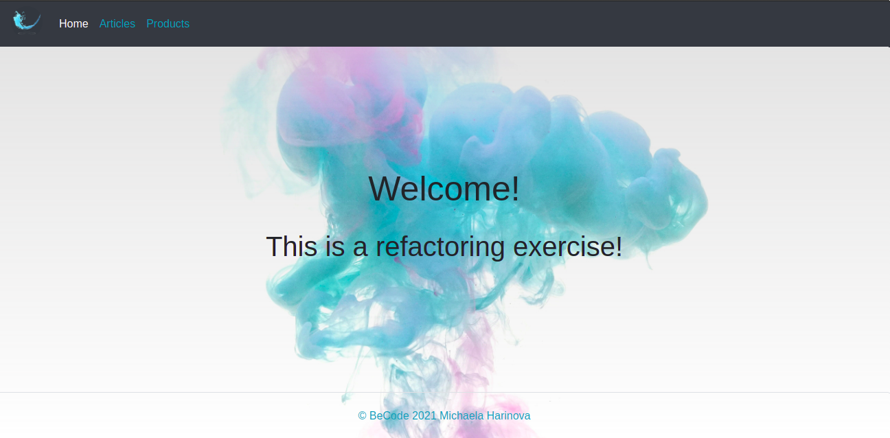
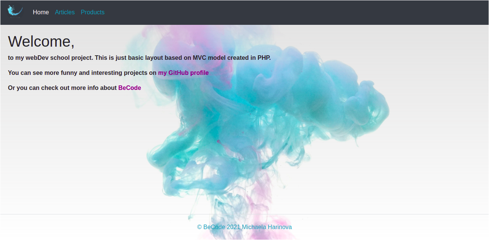
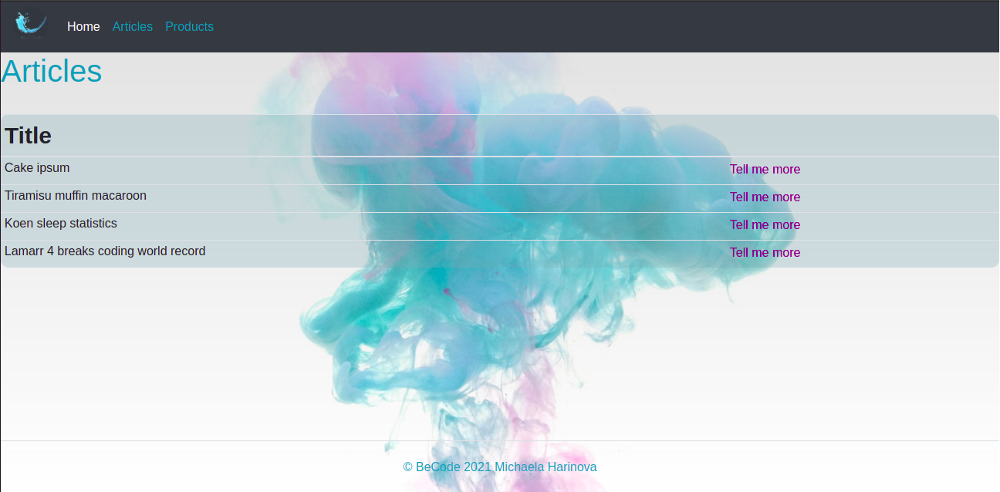
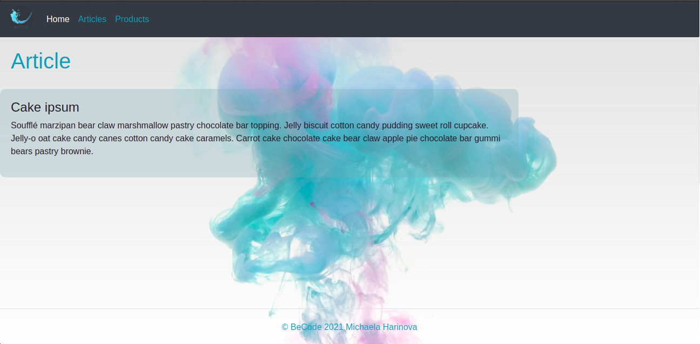
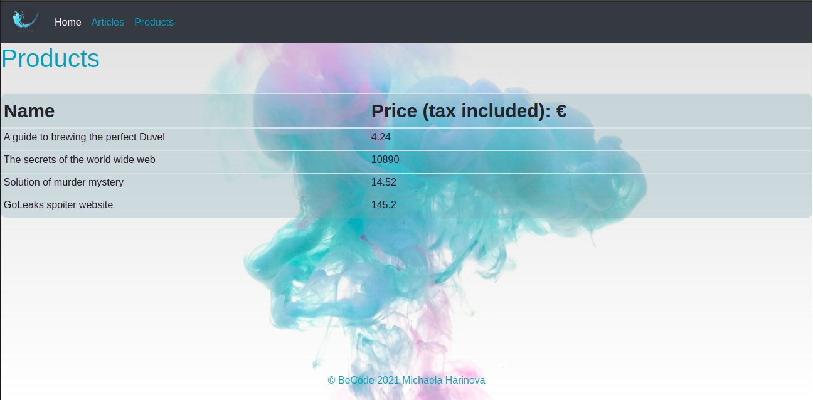

# myFundamentals

### Back to PHP with the MVC model!
 After some time when we were busy with frameworks such as .NET, Symfony or Angular it is time to repeat some PHP.
### This is an exercise where we build our own fundamentals.

>[Michaela Harinova](https://github.com/mharin)

#### A little project to repeat and review MVC model in PHP language.
#### This time we have to refactor an original inefficient code.

## Used technologies:
- PHP OOP
  - MVC model
- CSS
- Bootstrap
- HTML

## Learning objectives
> - #### Repeating of : 
>   PHP, OOP and MVC   
    database creation and connection    

> - Understanding of code from somebody else and be able to refactor it  

## The Mission
> - Transform original code into a well-structured MVC application without using any frameworks
> - Make sure you retain all functionality 
> - Show tables with data in a browser 
> - #### Add some extra stuffs such as:  
>  styling, error handling, database

## Interface of "myFundamentals" project
>#### Welcome page
>

>#### Titles of articles. Here you can click and open a specific one that got your attention
>

>#### Detail of an article with specific content
>  

>#### Products page
>
